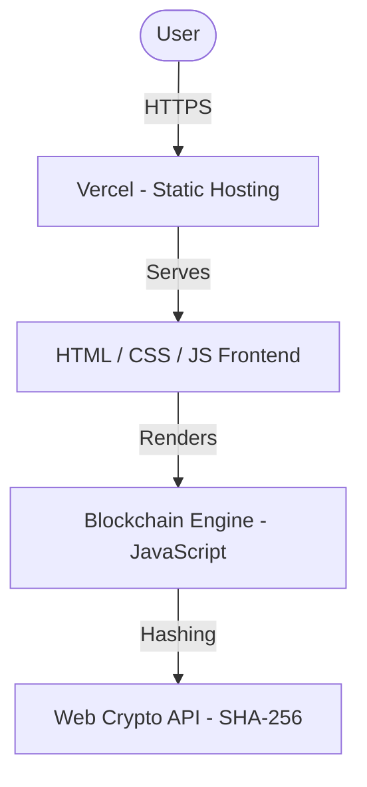

# ChainForge

<div align="center">
    
    
    
    
</div>

<p align="center">
    <i>An interactive blockchain simulator with real-time proof-of-work mining, transaction management, and chain validation. Dual implementation in Rust (CLI) and JavaScript (Web).</i>
</p>

## Overview

ChainForge is an educational blockchain implementation designed to demonstrate the core mechanics of distributed ledger technology. The project includes a complete Rust CLI implementation and a client-side web application that runs entirely in the browser.

### Core Capabilities

- **Proof-of-Work Mining**: Configurable difficulty with SHA-256 hashing
- **Transaction System**: Create, queue, and batch transactions into blocks
- **Balance Tracking**: Real-time balance computation across all addresses
- **Chain Validation**: Cryptographic integrity verification of the entire chain
- **Immutability Demonstration**: Tamper detection through hash chain verification
- **Interactive Web UI**: Visual blockchain explorer with mining animations

---

## System Architecture



The web application is fully client-side. Each user runs their own blockchain instance in the browser with no backend dependency. The Rust implementation serves as the reference codebase and CLI tool.

---

## Technology Stack

- **CLI Engine**: [Rust](https://www.rust-lang.org/) with SHA-256 (`sha2`), Serde serialization, Chrono timestamps
- **Web Engine**: Vanilla JavaScript (ES Modules) with [Web Crypto API](https://developer.mozilla.org/en-US/docs/Web/API/Web_Crypto_API)
- **Frontend**: HTML5, CSS3 (dark mode, glassmorphism, responsive)
- **Deployment**: [Vercel](https://vercel.com/) (static hosting)

---

## Data Model

### Transaction

Represents a transfer of value between two addresses.

```rust
pub struct Transaction {
    pub from: String,
    pub to: String,
    pub amount: f64,
}
```

### Block

Contains a batch of transactions and maintains chain integrity through cryptographic linking.

```rust
pub struct Block {
    pub index: u64,
    pub timestamp: DateTime<Utc>,
    pub transactions: Vec<Transaction>,
    pub previous_hash: String,
    pub hash: String,
    pub nonce: u64,
}
```

### Blockchain

Manages the ordered chain of blocks, pending transactions, and mining parameters.

```rust
pub struct Blockchain {
    pub chain: Vec<Block>,
    pub difficulty: usize,
    pub pending_transactions: Vec<Transaction>,
    pub mining_reward: f64,
}
```

---

## Mining Process

The blockchain uses a Proof-of-Work consensus mechanism:

1. **Transaction Pool**: New transactions are added to a pending queue
2. **Block Creation**: Miner collects pending transactions into a new block
3. **Hash Calculation**: Block hash is computed using SHA-256
4. **Nonce Iteration**: Nonce is incremented until the hash meets the difficulty target
5. **Block Addition**: Successfully mined block is appended to the chain
6. **Reward Distribution**: Miner receives a configurable mining reward

### Difficulty Target

The difficulty parameter determines how many leading zeros the block hash must contain:

| Difficulty | Required Prefix | Approximate Time |
| ---------- | --------------- | ---------------- |
| 1          | `0`             | Instant          |
| 2          | `00`            | ~0.1s            |
| 3          | `000`           | ~1-5s            |
| 4          | `0000`          | ~10-60s          |

---

## Security Model

### Cryptographic Hashing

- SHA-256 for all hash computations
- Each block references the hash of its predecessor
- Any modification to block data invalidates its hash and breaks the chain

### Immutability

- Modifying any transaction requires re-mining all subsequent blocks
- Proof-of-work makes tampering computationally expensive
- Chain validation detects all modifications

### Validation Example

```rust
// Attempt to modify a transaction
blockchain.chain[1].transactions[0].amount = 999999.0;

// Validation will detect the tampering
assert_eq!(blockchain.is_chain_valid(), false);
```

---

## Project Setup

### Rust CLI

#### Prerequisites

- Rust 1.70 or higher
- Cargo package manager

#### Run

```bash
cargo run
```

### Web Application (Local)

Open `frontend/index.html` directly in a browser, or serve it with any static server:

```bash
# Using Python
cd frontend && python -m http.server 8080

# Using Node.js
npx serve frontend
```

### Deployment to Vercel

1. Push the repository to GitHub
2. Import the project in [Vercel](https://vercel.com/)
3. Vercel will detect `vercel.json` and serve the `frontend/` directory
4. No build command required (static content)

---

## Configuration

### Adjustable Parameters

| Parameter       | Default | Description                              |
| --------------- | ------- | ---------------------------------------- |
| `difficulty`    | 2       | Number of leading zeros required in hash |
| `mining_reward` | 100.0   | Tokens awarded to the miner per block    |

```rust
let mut blockchain = Blockchain::new();
blockchain.difficulty = 4;       // Harder mining
blockchain.mining_reward = 50.0; // Lower reward
```

---

## Future Enhancements

- **REST API**: HTTP endpoints for blockchain interaction (Actix-web)
- **Persistence**: Save blockchain state to disk or IndexedDB
- **P2P Network**: Multi-node blockchain network simulation
- **Smart Contracts**: Basic contract execution
- **Wallet Integration**: Key management and digital signatures
- **Web Interface**: Browser-based blockchain explorer

---

## Contributing

1. Fork the repository
2. Create a feature branch (`git checkout -b feature/amazing-feature`)
3. Commit your changes (`git commit -m 'Add amazing feature'`)
4. Push to the branch (`git push origin feature/amazing-feature`)
5. Open a Pull Request

---

## License

This project is licensed under the MIT License. See the [LICENSE](LICENSE) file for details.

---

Built with precision for **ChainForge**.
